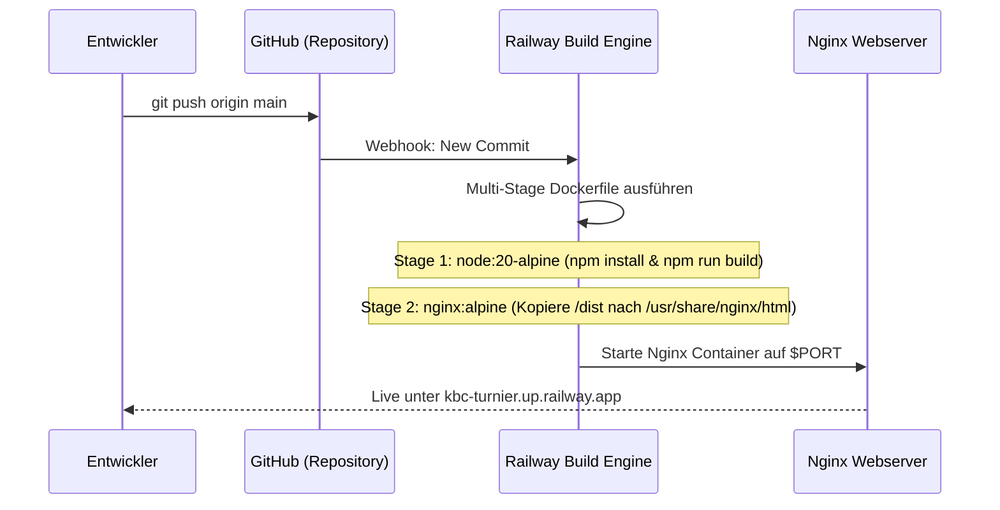

# Systemarchitektur & Deployment-Flow

Dieses Dokument beschreibt die Architektur der **KBC Hallenhockey-Turnierverwaltung**, den Datenfluss zwischen Client und Cloud-Diensten sowie die Deployment-Pipeline von GitHub zu Railway.

---

## 🏛️ Systemübersicht

```mermaid
flowchart TD
    subgraph Clients["Clients / Endgeräte"]
        AdminUI["/admin (Kampfgericht)<br/>Laptop / Tablet"]
        GuestUI["/ (Gäste & Zuschauer)<br/>Smartphones"]
        KioskUI["/kiosk (Hallen-Display)<br/>Smart TV / Großbildschirm"]
    end

    subgraph FirebaseServices["Google Firebase Backend"]
        Firestore["Cloud Firestore<br/>(Live NoSQL Database)"]
        Storage["Firebase Storage<br/>(Team-Logos & MP3-Jingles)"]
        Auth["Firebase Authentication<br/>(Kampfgericht Login)"]
    end

    subgraph Deployment["Hosting & CI/CD"]
        GitRepo["GitHub Repository<br/>(main branch)"]
        Railway["Railway Platform<br/>(Auto Build & Deploy)"]
        DockerNginx["Multi-Stage Docker<br/>(Node 20 Build + Nginx Alpine)"]
    end

    AdminUI -->|Write Scores / Control Timer| Firestore
    AdminUI -->|Upload Logos & Jingles| Storage
    AdminUI -->|Authenticate| Auth
    AdminUI -->|Trigger MP3 Playback| AdminUI

    Firestore -->|onSnapshot (Live Data)| GuestUI
    Firestore -->|onSnapshot (Live Data)| KioskUI
    Firestore -->|onSnapshot (Sync State)| AdminUI
    Storage -->|Serve Images & MP3| GuestUI
    Storage -->|Serve Images| KioskUI

    GitRepo -->|Webhook Trigger| Railway
    Railway --> DockerNginx
```

---

## 🧱 Schichtenarchitektur (Frontend)

```
src/
├── assets/             # Statische Assets (Icons, Platzhalter)
├── components/         # Wiederverwendbare UI-Komponenten
│   ├── ui/             # shadcn/ui Basiskomponenten (Button, Card, Dialog, Table etc.)
│   ├── admin/          # Kampfgericht-Komponenten (TimerControl, GoalModal, JinglePlayer)
│   ├── guest/          # Zuschauer-Komponenten (ScheduleView, StandingsTable, LiveMatchCard)
│   └── kiosk/          # Hallen-Display-Komponenten (KioskTicker, FullscreenBoard)
├── contexts/           # React Contexts (AuthContext, TournamentContext, AudioContext)
├── hooks/              # Custom Hooks (useLiveMatch, useStandings, useJingleAudio)
├── lib/                # Externe Client-Instanzen & Utilities (firebase.ts, utils.ts)
├── routes/             # React Router Konfiguration & Route Guards (ProtectedRoute)
├── services/           # Firestore & Storage Service-Funktionen (Matches, Teams, Settings)
├── types/              # TypeScript Schemas & Interfaces (Database, Tournament)
└── App.tsx             # Root-Komponente & Provider Tree
```

---

## 🔄 Echtzeit-Datenfluss (Firestore `onSnapshot`)

Um Latenzen und unnötige Polling-Requests zu vermeiden, basiert die gesamte Spielstands- und Zeitübertragung auf Firestore-Echtzeit-Subscriptions:

1. **Kampfgericht (`/admin`)**:
   - Schiedsrichter/Kampfgericht klickt auf "Tor Team Heim".
   - Der lokale AudioContext spielt sofort den gecachten MP3-Jingle des Heimteams ab.
   - Ein Firestore-Update erhöht `scoreHome` und hängt das Tor-Event an die Match-Historie an.
2. **Cloud Firestore**:
   - Replikation des Dokuments in Millisekunden.
3. **Zuschauer (`/`) & Kiosk (`/kiosk`)**:
   - Die aktiven `onSnapshot`-Listener erhalten den aktualisierten Spielstand.
   - React rendert die betroffenen Komponenten per Diffing neu.
   - Tabellenstände werden im Client über Memoized Selector (`useStandings`) unmittelbar neu berechnet.

---

## 🎵 Audio-Architektur (Torjingles)

- **Audio-Quelle**: MP3-Dateien werden im Firebase Storage unter `/teams/{teamId}/jingle.mp3` gespeichert.
- **Audio-Engine**: HTML5 Audio API über einen dedizierten React-Hook / AudioContext.
- **Preloading**: Beim Laden des Admin-Panels werden die Audio-Elemente der aktiven Teams vorab gepuffert (`preload="auto"`), um Verzögerungen beim Torjubel zu verhindern.
- **Fallback**: Besitzt ein Team keinen individuellen Jingle, wird ein Standard-Turnierjingle abgespielt.

---

## 🚢 Deployment-Pipeline (GitHub ➔ Railway)

Die Bereitstellung erfolgt vollautomatisch über Railway mittels eines Docker-Multi-Stage-Builds:



### Docker Multi-Stage Design
1. **Build Stage (`node:20-alpine`)**:
   - Installation aller Produktions- und Dev-Abhängigkeiten.
   - Vite-Build (`npm run build`) kompiliert TypeScript und generiert optimierte statische HTML-, JS- und CSS-Dateien in `/app/dist`.
   - Build-Args ermöglichen die Übergabe von Firebase-Environment-Variablen (`VITE_FIREBASE_*`).
2. **Production Stage (`nginx:alpine`)**:
   - Kopieren der Build-Artefakte in das Web-Root von Nginx.
   - Spezielle `nginx.conf` stellt SPA-Routing sicher (`try_files $uri $uri/ /index.html =404;`).
   - Gzip-Kompression und Caching-Header für unveränderliche Assets (`/assets/*`).
   - Minimaler Ressourcenverbrauch (Container-Footprint < 25 MB).
