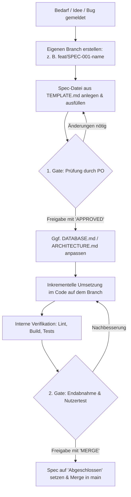

# Spezifikationen (Spec Driven Development) 📋

Willkommen im Spezifikationsverzeichnis der **KBC Hallenhockey-Turnierverwaltung**.

Gemäß unserem Leitprinzip **Spec Driven Development (SDD)** (verankert in [`AGENTS.md`](../AGENTS.md)) gilt:  
**Kein Code ohne Spezifikation.** Jedes neue Feature, jede funktionale Änderung und jeder nicht-triviale Bugfix muss vor Beginn der Implementierung in einer strukturierten Spezifikationsdatei beschrieben, geprüft und freigegeben werden.

---

## 🎯 Zweck & Ziele

1. **Gemeinsames Verständnis**: Vor dem Coden wird geklärt, *was* gebaut werden soll und *warum*.
2. **Klar definierte Abnahmekriterien**: Verhindert Missverständnisse, Scope Creep und unvollständige Features.
3. **Dokumentation als Single Source of Truth**: Technische Schemata (`DATABASE.md`) und UI-Architektur (`ARCHITECTURE.md`) bleiben stets mit den tatsächlichen Anforderungen synchron.
4. **Schutz vor Hardcoding & Fehlern**: Architektonische Leitplanken (z. B. keine fest codierten Zeiten, strikte Typisierung, Lifecycle von Firestore-Listenern) werden direkt in der Spec bedacht.

---

## 📁 Namenskonvention & Ablage

Alle Specs werden direkt im Ordner `spec/` abgelegt.

### Dateinamen-Schema
```text
spec/SPEC-[NUMMER]-[kurzbezeichnung].md
```

**Beispiele:**
- `spec/SPEC-001-team-logo-upload.md`
- `spec/SPEC-002-jingle-autoplay-fallback.md`
- `spec/SPEC-003-kiosk-live-ticker-toggle.md`
- `spec/SPEC-004-fix-timer-drift-background.md`

*(Bei Fixes kann optional das Präfix `FIX-` oder die einheitliche `SPEC-XXX`-Nummerierung verwendet werden).*

---

## 🚀 Workflow & Freigabeprozess (Branch, APPROVED & MERGE)

Jede Spec wird verbindlich in einem **eigenen Git-Branch** ausgearbeitet und umgesetzt. Es gilt ein strikter zweistufiger Freigabeprozess:



### Die Phasen im Detail:

1. **Eigener Branch erstellen**:
   - Für jede Spec wird ein dedizierter Branch angelegt (z. B. `git checkout -b feat/SPEC-001-team-logo-upload` oder `fix/SPEC-004-...`).
2. **Spec anlegen & ausfüllen**:
   - [`spec/TEMPLATE.md`](./TEMPLATE.md) in den Branch kopieren und alle Abschnitte ausfüllen. Status: `In Review`.
3. **1. Gate: Freigabe der Spec (`APPROVED`)**:
   - Die Spec wird dem Nutzer / Product Owner präsentiert.
   - **Stopp-Bedingung**: Es wird **kein Produktionscode** geschrieben, bevor der Nutzer die Spec nicht ausdrücklich mit dem Signalwort **`APPROVED`** freigegeben hat.
4. **Spezifikationsdokumente synchronisieren & Implementierung**:
   - Falls Schemata oder Architekturen betroffen sind, zuerst [`DATABASE.md`](../DATABASE.md) / [`ARCHITECTURE.md`](../ARCHITECTURE.md) nachziehen.
   - Code inkrementell auf dem Branch entwickeln.
5. **Verifikation**:
   - Linter (`npm run lint`), Build (`npm run build`) und Akzeptanzkriterien verifizieren.
   - Status in der Spec auf `In Abnahme` aktualisieren.
6. **2. Gate: Endabnahme & Merge (`MERGE`)**:
   - Dem Nutzer wird der fertige Stand zum Testen vorgelegt.
   - **Stopp-Bedingung**: Der Branch wird erst in `main` gemergt, wenn der Nutzer die Änderungen getestet und mit dem Signalwort **`MERGE`** freigegeben hat.
   - Nach Erhalt von `MERGE`: Status der Spec auf `Abgeschlossen` setzen und den Branch sauber in `main` mergen.

---

## ✍️ Richtlinien für das Verfassen einer Spec

### 1. User Stories
User Stories stellen den Menschen (Nutzer, Turnierleiter, Schiedsrichter, Zuschauer) in den Mittelpunkt.  
Verwende immer die standardisierte Schablone:

> **Als** [Rolle / Nutzertyp: z. B. Turnierleiter, Gast auf Smartphone, Hallen-Zuschauer vor dem TV]  
> **möchte ich** [konkrete Aktion oder Fähigkeit]  
> **um** [messbarer geschäftlicher oder organisatorischer Mehrwert].

*Beispiel:*  
„Als **Turnierleiter** möchte ich **die Dauer von Halbzeitpausen für das Folgespiel im laufenden Betrieb von 5 auf 10 Minuten anpassen können**, um **Verzögerungen im Turnierplan flexibel auszugleichen, ohne den Server neu starten zu müssen**.“

---

### 2. Akzeptanzkriterien (Acceptance Criteria)
Akzeptanzkriterien müssen **eindeutig, überprüfbar und binär (erfüllt / nicht erfüllt)** sein.  
Idealerweise nutzen komplexe Interaktionen das **Given-When-Then** (Gherkin) Format:

```markdown
- [ ] **AC-1: Jingle-Wiedergabe bei Toreingabe**
  - **Gegeben sei (Given)**: Die Turnierleitung befindet sich in der Live-Spielansicht `/admin/matches/:id` und für Team A ist eine MP3-URL hinterlegt.
  - **Wenn (When)**: Der Button „+1 Tor Team A“ geklickt wird.
  - **Dann (Then)**: Erhöht sich der Score von Team A um 1 in Firestore UND ein Pop-over / Audio-Trigger spielt den Jingle sofort ab.
```

Einfachere Anforderungen können als präzise Checkliste formuliert werden.

---

### 3. Technische & Architektonische Konsistenz
Jede Spec muss erklären, wie sie sich in das Gesamtsystem einfügt:
- **Datenmodell**: Welche Änderungen in Firestore sind nötig? Passt das Schema zu [`DATABASE.md`](../DATABASE.md)?
- **TypeScript**: Welche Interfaces müssen in `src/types/` ergänzt werden? (Kein `any` erlaubt!)
- **State & Subscriptions**: Wie wird `onSnapshot` subskribiert und im `useEffect` wieder freigegeben?
- **UI-Komponenten**: Welche vorhandenen Primitive aus `shadcn/ui` (z. B. Dialog, Sheet, Table, Badge) werden eingesetzt?
- **Kein Hardcoding**: Sind alle Timer, Zeiten, Teams und Gruppenparameter dynamisch aus Firestore bezogen?

---

### 4. Edge Cases & Fehlerbehandlung
Beschreibe unerwartete oder fehleranfällige Zustände vorab:
- Was passiert bei Verbindungsverlust (Offline)?
- Was geschieht, wenn zwei Turnierleiter dasselbe Spiel zeitgleich bedienen?
- Was passiert, wenn eine hochgeladene Datei keine valide MP3- oder PNG/SVG-Datei ist?
- Wie greift der Fallback, falls der Browser Audio-Autoplay blockiert?

---

### 5. Verifikations- und Testplan
Definiere vorab, wie die Funktionalität nachgewiesen wird:
- Manuelle Klickpfade für Gast- (`/`), Admin- (`/admin`) und Kiosk-Ansicht (`/kiosk`).
- Build- und Typprüfung (`npm run build`).
- Linting-Prüfung (`npm run lint`).

---

## 📑 Vorlage

Die universelle Vorlage findest du unter:  
👉 **[`spec/TEMPLATE.md`](./TEMPLATE.md)**
